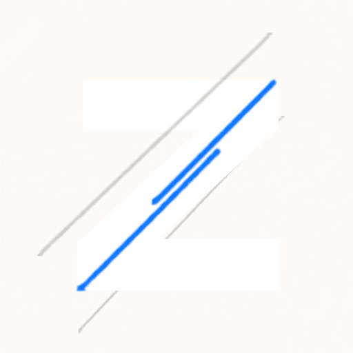

<p align="center">
  
</p>
<h1 align="center">Zaky's Developer Portfolio</h1>

<p align="center">
  
  
  
  
</p>

<p align="center">
  A custom, Python-powered static site generator for building a beautiful developer portfolio. It fetches live GitHub contribution data via the GraphQL API, renders dynamic SVG charts, and automatically deploys to GitHub Pages via NeonDB-logged CI pipelines.
</p>

---

## 📖 Documentation

Everything you need to understand, run, and modify this project is thoroughly documented in the `docs/` folder. Please refer to the links below:

- 🚀 **[Getting Started](docs/getting_started.md)** – Setup instructions and local previewing.
- 🏗️ **[Architecture & Build System](docs/architecture_and_build.md)** – How the custom Python SSG works under the hood.
- 📝 **[Data & Content](docs/data_and_content.md)** – How to easily update the content via `projects.md`.
- 🔌 **[GitHub API Integration](docs/github_api_integration.md)** – Details on the GraphQL queries and fallback systems.
- ⚙️ **[Deployment & CI/CD](docs/deployment_and_ci.md)** – How GitHub actions orchestrate the automated deployment and NeonDB logging.

## 🛠️ Tech Stack

| Technology | Purpose |
| ---------- | ------- |
| **Python 3.10+** | Core scripting logic, content parsing, and API interactions. |
| **Jinja2** | Powerful templating engine for generating HTML files. |
| **Markdown** | Content structure parsing (`projects.md`). |
| **Requests** | HTTP client for interacting with the GitHub GraphQL API. |
| **PostgreSQL (NeonDB)** | Logging database driven by `psycopg2` during CI/CD. |
| **GitHub Actions** | CI/CD automation. |
| **Vanilla HTML/CSS/JS** | The resulting beautifully generated static frontend output. |

## 🚀 Quick Run
```bash
# Clone the repository
git clone https://github.com/zakyislm/zakyislm.github.io.git
cd zakyislm.github.io

# Install dependencies
pip install -r requirements.txt

# Run the build
python build.py
```
For more details, see the [Getting Started Guide](docs/getting_started.md).

---
*Generated by Jax*
